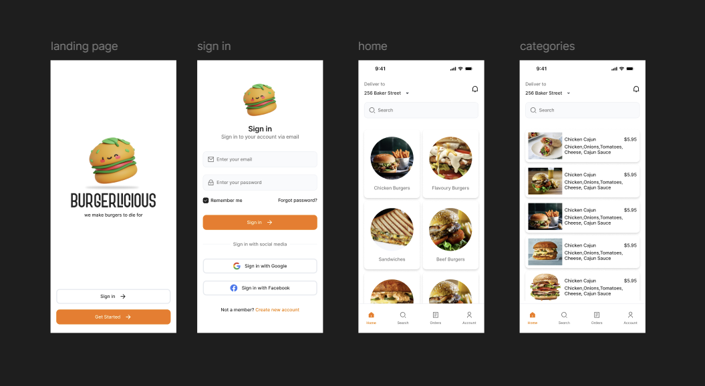
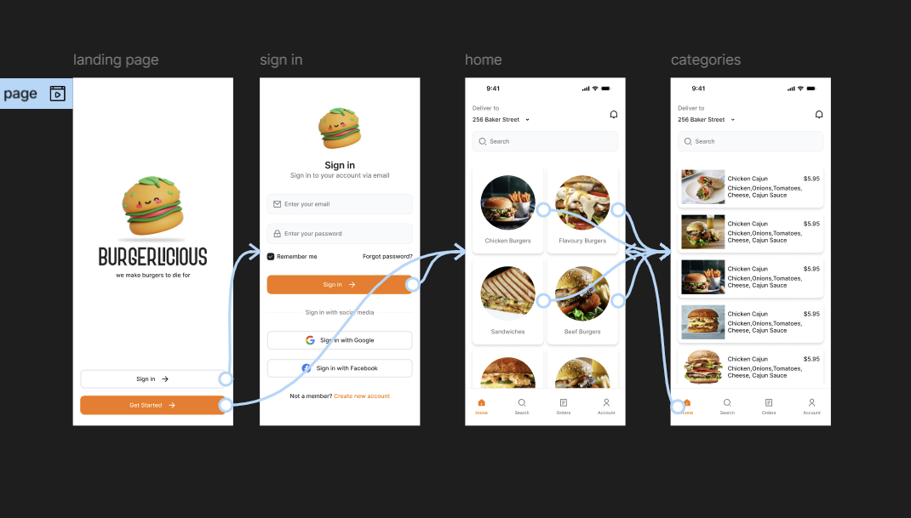

# 🍔 Burgerlicious - Figma UI Project

A modern **food ordering app UI** designed in Figma.  
This project focuses on creating an intuitive and visually appealing experience for browsing burgers, exploring categories, and placing orders.

👉 [View Live Prototype on Figma](https://www.figma.com/proto/EpjbdsjqVgdLlIVd6gpKpZ/Food-app?node-id=2-4&p=f&t=sYQzTPvY3UF2k23u-1&scaling=scale-down&content-scaling=fixed&page-id=0%3A1&starting-point-node-id=2%3A4)  

---

## 📱 Screens Overview

| Screen | Preview |
|--------|---------|
| **All Screens** |  |
| **Landing Page** |  |
| **Category Page** |  |
| **Category Page 2** |  |
| **Signup Page** |  |
| **Wireframes** |  |

## 👤 Author
**Kartik Gangavati**  
📌 [LinkedIn](https://www.linkedin.com/in/kartikgangavati) 

